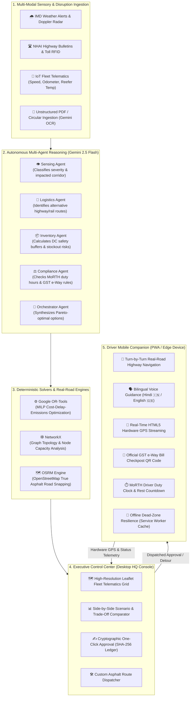

<div align="center">

# 🚛 ResilientChain AI (ResilientSupply)
### Autonomous Neuro-Symbolic Supply Chain Resilience & Deterministic Fleet Logistics Platform

[](https://www.python.org/)
[](https://fastapi.tiangolo.com/)
[](https://react.dev/)
[](https://www.typescriptlang.org/)
[](https://tailwindcss.com/)
[](https://developers.google.com/optimization)
[](https://ai.google.dev/)
[](https://www.docker.com/)
[](https://opensource.org/licenses/Apache-2.0)

<p align="center">
  <b>Engineered for high-stakes Indian freight corridors (NH-48, NH-52, Western DFC, JNPT).</b><br>
  Combines deterministic mathematical constraint solvers with multi-agent reasoning, true road geometry routing, closed-loop telematics, and a bilingual voice-guided driver companion PWA.
</p>

[Key Features](#-key-features) •
[Architecture](#-architectural-philosophy-hybrid-neuro-symbolic-ai) •
[Live Demo Walkthrough](#-live-showcase--demo-flow) •
[Quickstart](#-quickstart-guide) •
[Cloud & AWS Deployment](#-cloud--aws-deployment) •
[API Documentation](#-api-reference)

</div>

---

## 📌 Architectural Philosophy: Hybrid Neuro-Symbolic AI

In mission-critical enterprise logistics, purely generative AI models hallucinate travel times, violate physical road load constraints, and invent phantom routing solutions. Conversely, legacy ERP systems are rigid, require hours of manual reconfiguration during monsoons or highway closures, and lack contextual intelligence.

**ResilientChain AI solves this by decoupling calculation from reasoning:**

$$\text{Resilient Logistics} = \underbrace{\text{Deterministic Optimization}}_{\text{Google OR-Tools + NetworkX + OSRM}} + \underbrace{\text{Cognitive Multi-Agent Reasoning}}_{\text{Gemini 2.5 Flash Agents}} + \underbrace{\text{Closed-Loop Edge Telematics}}_{\text{Mobile Companion PWA}}$$

* **Deterministic Symbolic Layer**: Mathematical solvers (Google OR-Tools MILP, NetworkX Dijkstra/A*, and OSRM OpenStreetMap routing) compute verified travel times, true asphalt highway geometry, fuel consumption, SLA penalty costs, and inventory safety stock thresholds with **zero hallucination**.
* **Neural Multi-Agent Layer**: Autonomous specialized agents (Sensing, Logistics, Inventory, and Compliance) interpret unstructured NHAI / IMD weather circulars, formulate mitigation strategies, and draft human-understandable audit rationales.
* **Closed-Loop Telematics Layer**: When an executive approves a detour in headquarters, the platform dynamically dispatches the revised route directly to the driver's smartphone in transit, automatically triggering speech alerts in Hindi and English, updating turn-by-turn navigation, and issuing fresh digital GST e-Way bills.

---

## 🏗️ System Architecture & Data Flow



---

## ✨ Key Features

### 1. 🗺️ Real-Road Routing Engine (OSRM & Nominatim)
* **True Asphalt Highway Navigation**: Bypasses straight-line Euclidean approximations. Calculates true road distances, step-by-step driving manoeuvres, highway exit ramps, and turn angles across Indian national highways (NH-48, NH-44, NH-52, Golden Quadrilateral).
* **OpenStreetMap Geocoding**: Search any Indian city, MIDC industrial estate, distribution hub, or highway landmark (e.g. *Chakan Pune, Bhiwandi, Sanand Ahmedabad, Gurugram NCR*) with automatic latitude/longitude resolution.
* **Custom Route Dispatcher**: Dispatch custom multi-point road itineraries to commercial trucks with real-time ETA recalculation.

### 2. 📱 Closed-Loop Driver Mobile Companion (PWA)
* **Dual-Mode Operation**:
  * **Interactive Phone Simulator**: Launch an on-screen smartphone frame right inside your desktop browser for instant reviews, presentations, and testing without requiring physical devices.
  * **Physical Device Pairing**: Instant QR pairing via local Wi-Fi, hotspot, or public 4G/5G cellular cloud networks.
* **Bilingual Voice Guidance**: Full hands-free audio assistance supporting **Hindi (`🇮🇳 हिंदी`)** and **English (`🇬🇧 English`)** via the Web Speech API (`SpeechSynthesis` & `SpeechRecognition` voice dictation).
* **Digital GST e-Way Bill Pass**: Official compliance barcode with high-brightness toggle for state border RTO and commercial tax checkposts. Contains consignor/consignee GSTIN, invoice value, HSN codes, and cryptographic payload.
* **MoRTH Driver Duty & Rest Clock**: Tracks continuous driving hours against Indian Ministry of Road Transport & Highways guidelines, featuring automated rest break countdown timers with haptic vibration alerts.
* **Dynamic Closed-Loop Reroute Interception**: When headquarters approves an alternative corridor (e.g. SH-188 flood detour), the driver app immediately receives a high-priority dispatch notification, speaks the detour warning aloud, and reroutes navigation in real time.
* **Offline Cellular Dead-Zone Resilience**: Standalone Service Worker caching guarantees that driver passes, manifests, and cached route polylines remain fully accessible in remote rural dead zones with zero cell reception.

### 3. 📊 Scenario Analysis & Autonomous Optimization
* **Multi-Objective Trade-Off Scoring**: Evaluates candidate recovery strategies across four conflicting dimensions:
  1. **Financial Cost**: Extra fuel burn, toll charges, warehouse overtime, and contractual delay penalties.
  2. **Transit Delay**: Predicted arrival variance against agreed SLA windows.
  3. **CO₂ Carbon Emissions**: Environmental footprint of highway diversions vs rail substitution.
  4. **Stock-Out & Assembly Risk**: Probability of factory production line starvation or shelf stock-outs.
* **AI Strategy Synthesis**: Automatically proposes practical mitigations:
  * *Option A (Status Quo / Standby)*: Wait out highway waterlogging (+12.5h delay, high SLA penalty).
  * *Option B (State Highway 188 Bypass)*: +48 km asphalt detour (+1.2h delay, ₹6,400 fuel cost, 94% safety score).
  * *Option C (Multimodal Rail Rake Transfer)*: Transfer containers to CONCOR rail wagons at Sanand yard (+18h, zero highway risk).

### 4. 🏢 Multi-Tenant Enterprise Administration & RBAC
* **Custom Workspace Enrollment**: Self-serve onboarding for enterprise shippers, 3PL carriers, and manufacturers.
* **Granular Role-Based Access Control**:
  * **Operations Director**: Full authority to simulate disruptions, tune optimization objective weights, and authorize financial recovery plans.
  * **Logistics Dispatcher**: Monitor real-time fleet telematics, reassign vehicles, and broadcast two-way driver messages.
  * **Compliance Officer**: Audit GST e-way bills, driver hours-of-service compliance, and temperature logs.
* **Custom Supply Chain Graph Builder**: Add custom distribution centers, manufacturing plants, customer delivery points, and freight corridors with custom safety buffers and capacity limits.

### 5. 🔒 Tamper-Evident Cryptographic Audit Ledger
* Every AI recommendation, disruption detection event, human modification, and dispatch authorization is cryptographically hashed (`SHA-256`) and recorded in an immutable audit ledger with timestamps, user IDs, and rationale records for regulatory and board oversight.

---

## 🛠️ Technology Stack

| Domain | Technology | Description |
| :--- | :--- | :--- |
| **Backend Framework** | **FastAPI (Python 3.11+)** | High-performance asynchronous REST API with Pydantic v2 schemas and OpenAPI docs. |
| **Optimization Core** | **Google OR-Tools** | Mixed-Integer Linear Programming (MILP) solver for multi-objective recovery planning. |
| **Network Graph** | **NetworkX** | Graph-theoretic modeling of Indian multimodal freight topologies and corridor capacities. |
| **Road Routing Engine** | **OSRM + Nominatim** | True asphalt road calculations, turn manoeuvres, and geocoding via OpenStreetMap. |
| **Generative Intelligence** | **Gemini 2.5 Flash** | Multi-agent reasoning, document circular parsing (OCR), and executive rationale generation. |
| **Frontend Framework** | **React 19 + TypeScript** | Modern component architecture with strict typing and responsive executive layout. |
| **Styling & Design System** | **Tailwind CSS v4** | Executive Dark Slate monochrome palette designed for command centers. |
| **Interactive Maps** | **Leaflet & CartoDB** | High-performance fleet vector mapping with live pulsing beacons and road polylines. |
| **Mobile PWA & Edge** | **Service Workers + Web APIs** | Offline cache storage, HTML5 Geolocation, and bilingual Web Speech synthesis/recognition. |
| **Packaging & Container** | **Docker (Multi-Stage)** | Unified single-port container serving both React SPA and FastAPI backend. |

---

## 🚀 Quickstart Guide

### Prerequisites
* **Node.js** (v18 or higher) and `npm`
* **Python** (v3.11 or higher)
* **Git**

### 1. Clone the Repository
```bash
git clone https://github.com/IamQuantum/ResilientSupply.git
cd ResilientSupply
```

### 2. Backend Setup
```bash
cd backend
python3 -m venv venv
source venv/bin/activate    # On Windows: venv\Scripts\activate
pip install -r requirements.txt
uvicorn app.main:app --host 0.0.0.0 --port 8000 --reload
```
*API interactive documentation (Swagger UI) is available at: [http://localhost:8000/docs](http://localhost:8000/docs)*

### 3. Frontend Setup
Open a second terminal:
```bash
cd frontend
npm install
npm run dev -- --host
```
*The web console will be available at: [http://localhost:5173](http://localhost:5173)*  
*(All `/api` network requests are automatically proxied from `:5173` to the backend on `:8000`).*

---

## 🎬 Live Showcase & Demo Flow

To demonstrate the full end-to-end platform to an audience, executive panel, or judges, follow this 5-minute walkthrough:

```
Step 1: Executive Control Center (http://localhost:5173)
  ├── Observe live telematics of fleet truck MH-04-GP-8821 carrying biologics from Pune to Delhi.
  └── Notice the active high-severity disruption: Waterlogging at Bharuch Narmada Bridge (KM 204).

Step 2: Disruption Drilldown & Sensory Intelligence
  ├── Open the "Disruption Monitor" view.
  └── Review the automated impact calculation: +6.5h delay, ₹42,000 SLA penalty, high stock-out risk.

Step 3: Scenario Analysis & AI Strategy Recommendation
  ├── Switch to the "Scenario Analysis" tab.
  └── Compare Option A (Wait out flood) vs. Option B (SH-188 Detour) vs. Option C (Rail Substitution).
  └── Observe the multi-criteria optimization matrix recommending Option B (State Highway 188 Bypass).

Step 4: Cryptographic Human-in-the-Loop Sign-Off
  ├── Click "Review & Approve".
  └── Apply digital sign-off with cryptographic hash stamping to generate the compliance dispatch order.

Step 5: Closed-Loop Driver Companion Verification
  ├── Click "Driver Mobile App" in the top navigation bar.
  ├── The Interactive Phone Simulator opens directly on screen.
  ├── Click "Trigger HQ Reroute" -> The mobile app plays an alert chime, switches the map route to
  │   emerald green (SH-188 bypass), and speaks aloud in Hindi and English!
  └── Switch to the "e-Way Bill" tab to inspect the full-brightness checkpost GST inspection QR code.

Step 6: Real-Road Route Dispatcher
  ├── Click "Build Road Route" in the navbar.
  ├── Enter origin "Mumbai" and destination "Delhi" -> Click "Calculate Asphalt Route".
  └── Inspect the turn-by-turn road itinerary calculated by OSRM and click "Dispatch Route to Fleet".
```

---

## ☁️ Cloud & AWS Deployment

ResilientChain AI is packaged with a **production unified single-port architecture**: FastAPI serves both the REST API and the pre-built React frontend single-page application directly on port `8000`.

### Option A: AWS Lightsail Deployment (Easiest — 3 Minutes)

1. In the AWS Console, open **Amazon Lightsail** and click **Create instance**.
2. Choose **Linux/Unix** → **Ubuntu 22.04 LTS** or **24.04 LTS**.
3. Select the **$3.50/mo** or **$5/mo** plan (both include a **3-month free trial**).
4. Under the **Networking** tab of your instance, add a custom firewall rule:
   * **Port**: `8000` | **Source**: `Anywhere-IPv4` (`0.0.0.0/0`)
5. Click **Connect using SSH** to open the in-browser terminal and run:

```bash
# 1. Add 2GB swap space (prevents memory bottlenecks on low-RAM instances)
sudo fallocate -l 2G /swapfile && sudo chmod 600 /swapfile && sudo mkswap /swapfile && sudo swapon /swapfile

# 2. Install Docker & Git
sudo apt-get update -y && sudo apt-get install -y docker.io docker-compose git

# 3. Clone and launch
git clone https://github.com/IamQuantum/ResilientSupply.git
cd ResilientSupply
sudo docker-compose up -d --build
```
*Your app is live immediately at `http://<YOUR-LIGHTSAIL-PUBLIC-IP>:8000`!*

---

### Option B: Local / VPS Docker Compose
```bash
# Build and run the single-port unified container
docker-compose up -d --build

# View container logs
docker-compose logs -f
```

---

### 🌐 Instant Public HTTPS for Mobile Phones on 4G/5G

Mobile browsers (iOS Safari & Android Chrome) require **HTTPS** to grant permissions for hardware GPS tracking and voice speech recognition.

To give your local laptop or AWS instance an instant, secure public HTTPS URL accessible from any smartphone on cellular data:

```bash
# Run free Cloudflare Tunnel (no account required):
cloudflared tunnel --url http://localhost:8000

# Or via npx:
npx --yes localtunnel --port 8000
```
Copy the resulting HTTPS URL (e.g. `https://xyz.trycloudflare.com`), open the **Driver Mobile App** modal, switch to the **Remote 5G / Public Cloud** tab, and paste the URL. Any smartphone can scan the QR code and connect from anywhere in the world!

---

## 📡 API Reference

| Method | Endpoint | Description |
| :--- | :--- | :--- |
| `GET` | `/api/health` | Comprehensive engine health check (OR-Tools, SQLite, Gemini GenAI). |
| `GET` | `/api/disruptions` | Retrieves all active disruption incidents with delay and risk metrics. |
| `POST` | `/api/disruptions/custom` | Injects a custom highway or warehouse disruption into the simulation. |
| `POST` | `/api/optimize` | Runs Google OR-Tools multi-objective recovery solver across candidate corridors. |
| `POST` | `/api/approvals/{incident_id}` | Cryptographically signs off on a strategy and triggers automated dispatch. |
| `GET` | `/api/driver/trip/{truck_id}` | Returns active trip waypoints, e-Way bill data, weather alerts, and navigation polylines. |
| `POST` | `/api/driver/telemetry` | Ingests live hardware GPS coordinates, speed, and heading from the driver's phone. |
| `POST` | `/api/driver/reroute/push` | HQ dispatch push: alerts driver of an approved detour. |
| `POST` | `/api/driver/reroute/accept` | Driver confirmation: accepts proposed detour and switches active navigation. |
| `POST` | `/api/routing/calculate` | OSRM road engine: computes real asphalt highway geometry, distance, and turns. |
| `POST` | `/api/routing/dispatch` | Dispatches an asphalt road itinerary directly to a fleet vehicle. |
| `GET` | `/api/system/host-info` | Auto-detects local LAN IP and public ports for QR code mobile pairing. |

---

## 📂 Project Directory Structure

```
ResilientSupply/
├── backend/                        # FastAPI Python Core Backend
│   ├── app/
│   │   ├── main.py                 # REST API endpoints & SPA static file serving
│   │   ├── agent_orchestrator.py   # Gemini 2.5 Flash multi-agent intelligence
│   │   ├── routing_service.py      # OSRM real-road navigation & OSM geocoding
│   │   ├── solver.py               # Google OR-Tools MILP recovery solver
│   │   ├── telemetry.py            # IoT telemetry generator & driver trip state
│   │   ├── document_parser.py      # AI OCR parsing of unstructured circulars
│   │   └── models.py               # SQLAlchemy database models & schemas
│   └── requirements.txt            # Python dependencies (FastAPI, OR-Tools, etc.)
│
├── frontend/                       # React 19 + TypeScript Client
│   ├── src/
│   │   ├── components/             # Reusable UI components
│   │   │   ├── CustomRouteModal.tsx # OSRM real-road route builder modal
│   │   │   ├── FreightNetworkMap.tsx# Leaflet live telematics vector map
│   │   │   ├── Navbar.tsx          # Navigation header with quick-action modals
│   │   │   └── Sidebar.tsx         # Executive navigation sidebar
│   │   ├── mobile/                 # Driver Companion Platform
│   │   │   ├── DriverMobileApp.tsx # Standalone mobile PWA & navigation console
│   │   │   └── DriverQrModal.tsx   # Phone simulator & 5G cloud pairing modal
│   │   ├── views/                  # Primary workspace screens
│   │   │   ├── ControlCenter.tsx   # Live fleet map & KPI overview
│   │   │   ├── DisruptionMonitor.tsx# Real-time incident assessment
│   │   │   ├── ScenarioAnalysis.tsx # Strategy comparator & solver weights
│   │   │   ├── ReviewApproval.tsx  # Cryptographic approval & dispatch bundle
│   │   │   └── AuthView.tsx        # Multi-tenant authentication & enrollment
│   │   ├── services/api.ts         # Unified API client (auto-proxied)
│   │   └── types.ts                # Shared TypeScript domain interfaces
│   ├── public/sw.js                # Offline PWA service worker
│   ├── package.json                # Frontend dependencies (React 19, Leaflet, Vite)
│   └── vite.config.ts              # Vite configuration with automatic /api proxy
│
├── Dockerfile                      # Multi-stage production container definition
├── docker-compose.yml              # Single-port production container compose
└── README.md                       # Enterprise project documentation
```

---

## 👥 Multi-Role Demo Credentials

For testing and demonstration, use the pre-configured enterprise profiles:

| Role Persona | Identifier | Capabilities |
| :--- | :--- | :--- |
| **VP of Supply Chain** | `lead_ops` | Full authority: simulate disruptions, tune solver weights, authorize execution. |
| **Fleet Dispatcher** | `dispatcher_mumbai` | Real-time fleet tracking, two-way driver messaging, and custom route dispatch. |
| **Compliance Officer** | `compliance_delhi` | Verify GST e-Way bills, cold-chain temperature thresholds, and MoRTH duty audits. |

---

## 📄 License

This project is licensed under the **Apache-2.0 License**. See the [LICENSE](LICENSE) file for details.
