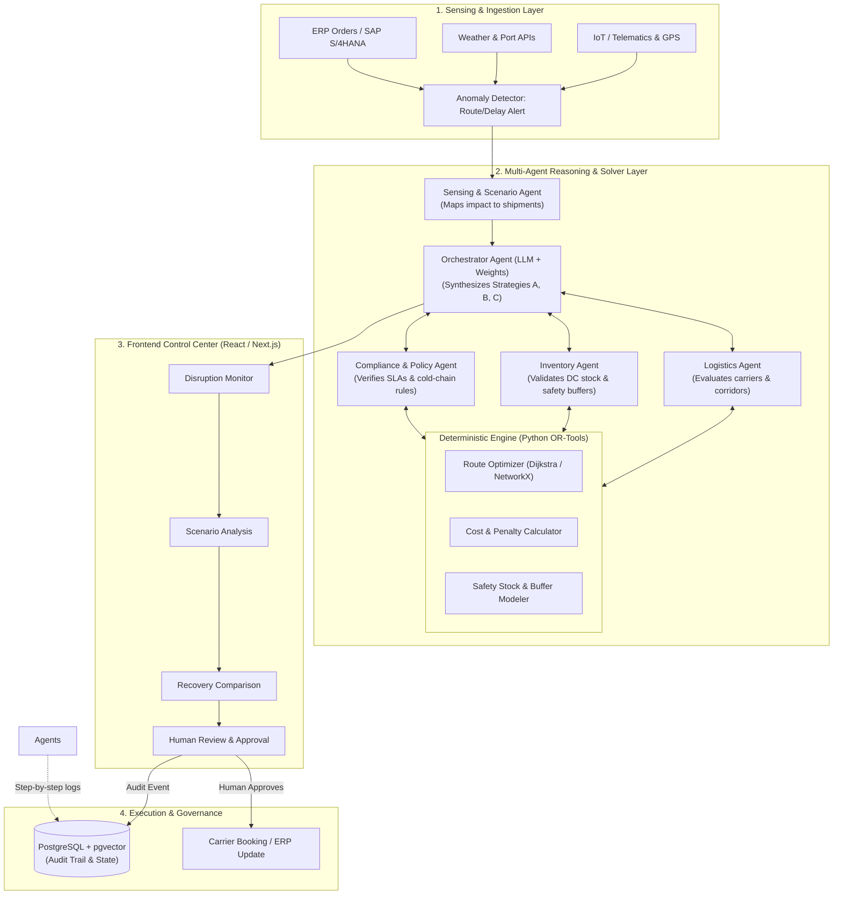
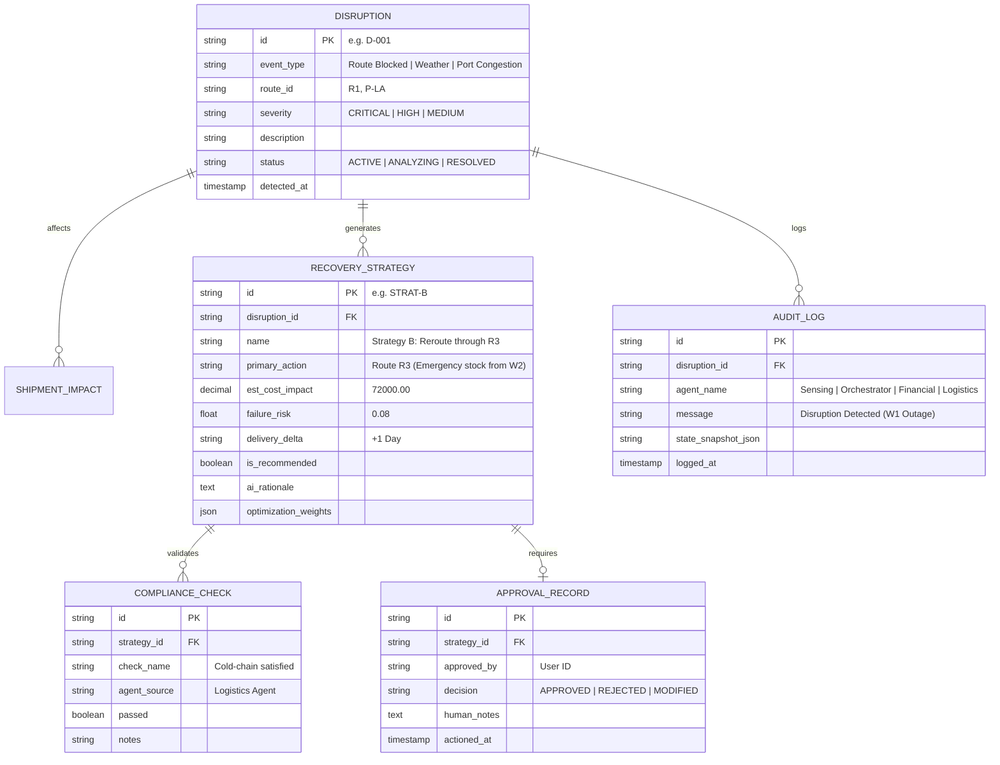

# ResilientChain AI: Complete Architecture & Implementation Blueprint

> [!NOTE]
> This blueprint is synthesized from your design mockups ([`screen.png`](file:///home/quantum/Projects/Resiliant/screen.png) through [`screen (5).png`](file:///home/quantum/Projects/Resiliant/screen%20(5).png)) and your project slide deck ([`ResilientChain_AI_Generalized_Project_Presentation.pptx`](file:///home/quantum/Projects/Resiliant/ResilientChain_AI_Generalized_Project_Presentation.pptx)).

---

## 1. Executive Summary & Core Philosophy

Your presentation highlights the golden rule of enterprise supply chain AI:

> **"Use normal code for deterministic calculations; use GenAI mainly for reasoning, interpretation, and explanations."**

Supply chains are governed by physical laws, hard constraints (warehouse capacity, truck volume, cold-chain temperature thresholds, driver hours-of-service), and financial balance sheets.
* **Do NOT rely on an LLM to calculate routes, optimize costs, or balance inventory matrices.** LLMs hallucinate numbers and cannot solve linear programs reliably.
* **Use a Hybrid Neuro-Symbolic Architecture**:
  1. **Deterministic Optimization Solvers (Symbolic)**: Google OR-Tools / NetworkX calculate the exact optimal routes, cost variations, and delivery delay hours.
  2. **Multi-Agent GenAI (Neural)**: Analyzes the context, parses unstructured incident reports, generates human-understandable trade-off narratives ("Why Strategy B?"), performs policy compliance checks, and orchestrates actions.
  3. **Human-in-the-Loop Governance**: Crucial decisions require explicit human authorization with a cryptographic audit trail.

---

## 2. Multi-Agent & System Architecture



---

## 3. AI Approach: Model Selection, Training vs Prompting

### Should You Train / Fine-Tune a Model?
* **For MVP and Production v1: NO fine-tuning is required.**
  - **Reason**: Supply chain rules change constantly (fuel surcharges, port strikes, carrier contracts). Fine-tuning bakes static knowledge into weights, creating maintenance debt.
  - **The Better Approach: Agentic RAG + Structured Tool Calling (Pydantic / Function Calling)**.
  - Feed real-time telemetry, ERP state, and solver results into the LLM context. The LLM translates raw mathematical options into the executive explanations seen on your screens.
* **When to Fine-Tune (Phase 3+)**:
  - Only fine-tune a compact 8B/14B model (e.g., Llama-3.1-8B, Qwen-2.5-14B) on historical post-mortem logs once you have collected 5,000+ real disruption approvals and planner feedback notes.

### Recommended Model Tiering

| Layer / Role | Recommended Models | Purpose |
| :--- | :--- | :--- |
| **Primary Orchestrator & Rationale Writer** | Gemini 2.5 Flash / Claude 3.5 Sonnet / GPT-4o | Generates the rationale in [`screen (5).png`](file:///home/quantum/Projects/Resiliant/screen%20(5).png) ("Why Strategy B"), synthesizes multi-agent findings, and evaluates complex trade-offs. |
| **Fast Sub-Agents (Compliance, Logistics Check)** | Gemini 2.5 Flash-Lite / GPT-4o-mini | Low-latency schema validation, policy checklist checking, and fast classification. |
| **Local / Private Enterprise Alternative** | Llama 3.3 70B (via vLLM / Ollama) or Qwen 2.5 32B | For on-premises air-gapped supply chain environments with sensitive military or proprietary logistics data. |
| **Deterministic Optimization Engine** | **Google OR-Tools** (Python) + **NetworkX** | Mixed-Integer Programming (MIP) for carrier dispatch, min-cost network flow, and route graph optimization. |

---

## 4. Frontend Design & Screen Breakdown

Your mockups have a cohesive, enterprise UI system (clean whites, `#0F172A` headings, `#2563EB` primary blues, pastel status alerts, and clear visual hierarchy). Here is how the 5 screens map directly into application routes:

### 1. Control Center (`/dashboard` or `/`) - [screen.png](file:///home/quantum/Projects/Resiliant/screen.png)
* **Header**: Global search bar, notifications badge, settings, profile avatar.
* **KPI Metric Cards**:
  - Active Disruptions (`1` with red accent border)
  - At-Risk Shipments (`5` with amber accent border)
  - Stock-Out Risk (`72%` with red accent border)
  - Pending Approvals (`1` with blue accent border)
* **Active Disruption Callout**: Soft salmon alert box detailing Route R1 blockage with key figures and "View Impact" button.
* **Live Activity Feed**: Step-by-step progress timeline of the agent pipeline.
* **Quick Recommendation Card**: Summary of Strategy B with "Approve" and "Request Modification" action buttons.

### 2. Disruption Monitor (`/monitor`) - [screen (2).png](file:///home/quantum/Projects/Resiliant/screen%20(2).png)
* **Summary Badges**: Total Active (`14`), Critical (`3`).
* **Active Events Table**: Filterable list with ID, Event Type, Route tag, Severity badge, Impact, and Time.
* **Slide-Over Detail Drawer**:
  - Detailed incident summary and timestamped sensory alerts.
  - Predicted Impact Summary cards: Estimated Delay (Hourglass), Stock-Out Risk (Alert badge), Additional Cost (Currency icon).
  - Primary CTA: **"Analyze Recovery Options"**.

### 3. Scenario Analysis (`/analysis/[incidentId]`) - [screen (3).png](file:///home/quantum/Projects/Resiliant/screen%20(3).png)
* **Incident Header**: Route R1 Blocked, Active Incident badge, Delay & Risk overview.
* **KPI Strip**: Delay (`+48h`), Stock-Out (`14.5%`), Additional Cost (`₹42.5k`), Affected Customers (`3 Tier-1`).
* **Business Impact Projection**: Dual horizontal comparison bars comparing Baseline vs Post-Disruption for:
  - Average Delay (Hours): 12h baseline vs 60h impact
  - Delivery Failure Risk (%): 5% baseline vs 72% impact
  - Logistics Cost Variance (₹): ₹12k baseline vs ₹54.5k impact
* **Inventory Impact Node Status**: Regional DC breakdown (Frankfurt Hub - *Below Safety Threshold*, Munich Satellite - *Available*, Berlin - *Available*).
* **Footer Status**: "AI Orchestrator analyzing..." indicator with **"Generate Recovery Options"** button.

### 4. Recovery Options Comparison (`/options/[incidentId]`) - [screen (4).png](file:///home/quantum/Projects/Resiliant/screen%20(4).png)
* **Options Matrix**: Strategy A (Standard Reroute), Strategy B (Recommended - Air Freight Expedite), Strategy C (Hybrid Rail/Sea) with comparative columns for Cost, Risk, and Delivery time.
* **Inventory & Compliance Impact**: Buffer stock drawdown warnings and SLA penalty mitigations.
* **"Why Strategy B?" AI Card**: Natural language justification for the recommended plan.
* **Optimization Weights Visualizer**: Interactive weight progress bars:
  - Delivery Time (Risk): 40%
  - Cost: 30%
  - Inventory Impact: 20%
  - Compliance: 10%
* **CTA**: **"Continue to Validation ->"**.

### 5. Review & Human Approval (`/approvals/[id]`) - [screen (5).png](file:///home/quantum/Projects/Resiliant/screen%20(5).png)
* **Urgency Banner**: "High-Impact Action Required", Disruption ID, Time to Impact: `14h 22m`.
* **Strategy Breakdown**: Primary Action (Route R3), Est. Cost Impact (`₹72k`), Failure Risk (`8%`).
* **AI-Generated Rationale Card**: Multi-agent narrative detailing why alternative Strategy A was rejected (excess cost) and why Strategy B was selected.
* **Multi-Agent Compliance Verification**: Interactive checklist of automated policy checks (Cold-chain, Safety stock, Capacity, Customs).
* **Live Audit Trail**: Chronological chain-of-custody logging each agent's execution timestamp.
* **Sticky Decision Bar**: Reject, Modify Plan, and **"Approve Recovery"** button.

---

## 5. Backend Architecture & Database Schema

### Tech Stack Recommendation
* **Backend**: **Python FastAPI**
  - Direct integration with Google OR-Tools, NetworkX, and LangGraph/Pydantic-AI.
  - Native async WebSocket support for pushing real-time agent status updates to the UI.
* **Frontend**: **Next.js (App Router) / React + TypeScript + Tailwind CSS**
  - Component library: **shadcn/ui** (Radix UI primitives) for accessible drawers, modals, tables, and buttons.
  - Icons: **Lucide React**.
  - Charts: **Recharts** or **Tremor**.
* **Database**: **PostgreSQL** (with Prisma or SQLAlchemy ORM) + **Redis** (for pub/sub WebSocket notifications).

### Database Schema (Entity-Relationship)



---

## 6. Implementation Roadmap

```
├── Phase 1: Interactive Frontend Prototype (1-2 days)
│   ├── Set up Next.js / Vite + Tailwind CSS + Lucide Icons
│   ├── Implement responsive layout (Sidebar, Navbar, global search)
│   ├── Build the 5 core views (Control Center, Monitor, Analysis, Options, Approvals)
│   └── Wire mock state machine enabling the end-to-end user journey
│
├── Phase 2: FastAPI Backend & Solver Integration (2-3 days)
│   ├── Create FastAPI endpoints (/api/disruptions, /api/scenarios, /api/optimize)
│   ├── Implement OR-Tools routing solver and cost/risk objective function
│   └── Implement PostgreSQL schema and seed sample supply chain network data
│
├── Phase 3: Multi-Agent Orchestration (2-3 days)
│   ├── Implement LangGraph multi-agent loop (Sensing, Logistics, Inventory, Orchestrator)
│   ├── Structured output prompts for compliance validation and rationale generation
│   └── WebSocket server for real-time agent thinking indicator
│
└── Phase 4: Verification, Polish & Enterprise Integration
    ├── Human approval webhook / ERP execution simulation
    ├── Audit trail cryptographic hash chain
    └── End-to-end walkthrough demo script
```
